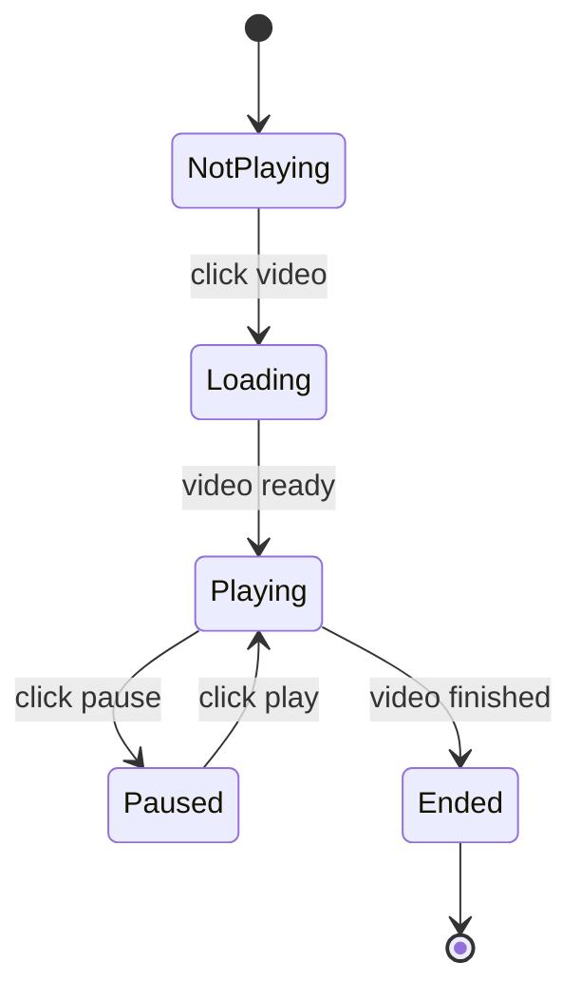

State Machine assistant. Automatically determines the **Feature / Version** stage from the argument. Forbidden: writing test_matrix/stage-ui-prototype/feature / modifying repo code / commit / push.

**When to run**: there is a clear state transition (eligibility/display/flow/permission switching), the same object's state spans multiple triggers, or boundary/cooldown/A-B split. For simple tickets go straight to `/stage-write-bdd`. When unsure → ask the user.

---

## Phase 0: Determine stage + path

| argument | Stage | Prerequisite | Output path |
|---|---|---|---|
| `TICKET-xxx` | Feature | `features/{ticket}/test_matrix.md` (missing → run `/stage-test-matrix` first) | `features/{ticket}/state_machine.md` |
| `vX.X TICKET-xxx` | Version | `versions/{version}/testcases/{ticket}/test_matrix.md` (missing → run `/stage-test-matrix` first) | `versions/{version}/testcases/{ticket}/state_machine.md` |

If the argument is incomplete, ask.

---

## Step 1: Decide the mode (Version only; Feature goes straight to Step 2)

```bash
ls features/{ticket}/state_machine.md 2>&1
ls versions/{version}/testcases/{ticket}/state_machine.md 2>&1
```

| features/ | versions/ | Action |
|---|---|---|
| exists | missing | Move (`git mv`) |
| missing | missing | Rewrite |
| — | exists | Ask the user: enhance/overwrite/cancel |

## Step 2: Read data

Read test_matrix.md (products involved table, business states, condition→behavior, remaining `?`) + fetch the Jira ticket for extra context.

## Step 3: Confirm target-site behavior (skip this step in move mode)

YouTube is an external site (https://www.youtube.com, guest/logged-out), no in-house repo. Use the ticket description + observation from walking the live target site as the source of truth, and confirm the state transitions match the current situation.

## Step 4: Execute move mode (Version only)

```bash
git mv features/{ticket}/state_machine.md versions/{version}/testcases/{ticket}/state_machine.md
```

Check the remaining files in features/{ticket}/; once everything is moved it can be deleted (ask the user). After moving, go to Step 6 to update the header.

## Step 5: Write the state machine draft (rewrite mode)

**Main structure:**
1. Summary table of new/modified UI elements (component name / page it is on / cooldown / A-B)
2. mermaid `stateDiagram-v2` (eligibility/display/flow/permission, added or removed per ticket)
3. Corresponding BDD paths (leave `?` for now, used by `/stage-write-bdd`)



## Step 5.1: Transition coverage requirements + self-check (mandatory output)

A state machine must not only draw the legal happy path. Each draft is required to have:

- **(a) Full legal-transition coverage (0-switch)**: **every edge** on the diagram must have a corresponding BDD path (do not miss any legal transition).
- **(b) Illegal/unreachable transitions (negative)**: enumerate transitions that "should not happen" as negative scenarios — when a user attempts a disallowed action from some state, the system should block it. E.g. `Ended --> Paused` (cannot pause after finishing), or clicking pause while in the `NotPlaying` state has no effect. The current example only has legal edges; **the negative case is the biggest gap.**

Produce a "transition coverage self-check table" and paste it at the end of the draft:

```markdown
### Transition coverage self-check
| Transition (source→target : condition) | Type | Has corresponding BDD path? |
|---|---|---|
| NotPlaying→Loading : click video | legal (0-switch) | ✅/? |
| Playing→Paused : click pause | legal (0-switch) | ✅/? |
| Ended→Paused | illegal/unreachable | ✅/? (should be blocked) |
```

## Step 6: Header format (fixed)

**Feature:**
```markdown
# {ticket} — {full Jira title}
> Jira: https://your-workspace.atlassian.net/browse/{ticket}
> Corresponding test_matrix: [test_matrix.md](./test_matrix.md)
```

**Version:**
```markdown
# {ticket} — {full Jira title}
> Jira: https://your-workspace.atlassian.net/browse/{ticket}
> Version: {version} ｜ Lead QA: {from plan.md}
> Corresponding test_matrix: [test_matrix.md](./test_matrix.md)
```

## Step 7: Fill in `?`

Observe state transitions by walking the live target site (guest/logged-out) to fill in `?`; write confirmed behavior directly, keep `?` for what cannot be confirmed. If an answer also applies to test_matrix → update it while you are at it.

## Step 8: Write the file

`Write` to the corresponding output path.

## Report

```
Produced {output path} (Feature/Version · move/rewrite)
Filled in N items ｜ still ? M items
test_matrix updated: {yes/no, list items}
Next step: /stage-write-bdd {argument}
```

---

## Rules

- No test_matrix.md → stop; do not draw for simple tickets; ask the user when unsure
- Version: merge features/ into the version container `versions/{version}/testcases/{ticket}/` using `git mv` (preserves history); Feature needs no git mv
- YouTube is an external site with no in-house repo; corroborate by walking the live target site; no commit / push
- Always `Write` to write files; use stateDiagram-v2 for mermaid; header format is fixed
- **Every legal transition (0-switch) must have a corresponding path + list illegal/unreachable transitions as negative cases**; the draft must include the "transition coverage self-check table" (Step 5.1), not just the happy path
