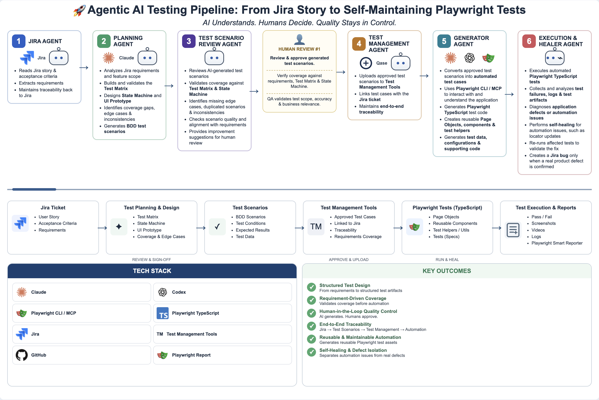

<div align="center">

# Playwright-Web-Agentic-Engineering-Automation

**An end-to-end QA engineering pipeline, driven by AI agents all the way from Jira ticket to release sign-off**

[](https://claude.ai/code)
[](https://openai.com/codex)
[](https://playwright.dev)
[](LICENSE)
[](https://youtube-e2e-smart-report.pages.dev)

**English** · [繁體中文](README.zh-TW.md)

</div>

---



---

## Overview

`Playwright-Web-Agentic-Engineering-Automation` is an end-to-end AI QA engineering pipeline that chains **test planning**, **BDD case authoring**, **automated execution**, **main library merge**, and **release sign-off** into a single line driven entirely by AI agents — humans only make the quality decisions. It uses **`https://www.youtube.com`** as the live target to fully demonstrate how this pipeline works.

> AI handles the tedious work; humans make the quality decisions.

> 📌 This repo uses **YouTube** (`www.youtube.com`) as the example product under test to showcase the whole pipeline; when adopting it for your own project, just swap the test target for your product URL.

**Interactive diagrams**: [pipeline.html](pipeline.html) (pipeline overview) · [skills-guide.html](docs/skills-guide.html) (which skill to use at each stage).

---

## Full Pipeline

<table>
<tr>
<td width="30%" valign="top">

**`01`&nbsp; Test Planning**

The AI reads the Jira ticket (`TICKET-xxx`) and automatically produces a structured Test Matrix and risk scenarios before any case is written, with QA reviewing and confirming the scope.

</td>
<td width="4%" align="center" valign="middle">→</td>
<td width="30%" valign="top">

**`02`&nbsp; Test Case Generation**

BDD `.feature` files are generated automatically from the validated matrix, with each scenario mapped to a ticket. Once written, an independent subagent scores them and gives recommendations; they are executed only after human review.

Test areas: Search · Video Playback · Channel · Search Filters

</td>
<td width="4%" align="center" valign="middle">→</td>
<td width="30%" valign="top">

**`03`&nbsp; Feature Testing & E2E Automation**

After the BDD cases are designed, `youtube/` (Playwright + playwright-bdd) automatically executes the web scenarios, while QA monitors and validates edge cases.

</td>
</tr>
<tr><td colspan="5"><br></td></tr>
<tr>
<td valign="top">

**`04`&nbsp; Merge Back & Archive**

After a version passes, the approved `.feature` files are merged back into the `testcases/` main testcases library. New files are copied whole; Modified files are intelligently merged scenario by scenario; the `versions/{version}/testcases/` staging area is cleared.

</td>
<td align="center" valign="middle">→</td>
<td valign="top">

**`05`&nbsp; Quality Gate**

Risk matrix analysis, RIDER-format bug reports, and a sanity check confirming the main flows have no breaks — QA makes the final call on whether to release.

</td>
<td align="center" valign="middle">→</td>
<td valign="top">

**`06`&nbsp; Sync & Traceability**

Every case links back to its Jira ticket. Once a TEST Sub-task is created, the assignee is set automatically and it is transitioned to Done. The go / no-go decision is confirmed by a human.

Ticket → BDD Case → TEST Sub-task → Release

</td>
</tr>
</table>

---

## Workflow

```
Feature stage → features/{ticket}/
Version stage → versions/{v}/
Main library  → testcases/ (single source of truth)
```

Pipeline overview: [pipeline.html](pipeline.html)
Which skill to use at each stage: [skills-guide.html](docs/skills-guide.html)
Text-based single source of truth: [docs/qa-workflow-map.md](docs/qa-workflow-map.md)

---

## E2E Automation (youtube/)

An E2E automation framework for YouTube Web, based on **Playwright + playwright-bdd**. The `.feature` scenarios produced during the BDD design stage are implemented here as automatically executable Playwright tests (guest/logged-out state, covering search / playback / channel / filters).

→ [youtube/README.md](youtube/README.md)

**Live test report** (auto-published to Cloudflare Pages after every CI run): [youtube-e2e-smart-report.pages.dev](https://youtube-e2e-smart-report.pages.dev)

---

## Start Here (New Members)

→ **[Getting Started (Step 1: Project Overview)](docs/tutorial/01-overview.md)**

Five steps take you from zero to up and running, finishing by connecting to the YouTube Web E2E automation framework.

---

## Quick Start

```bash
git clone https://github.com/JulianWangHZ/Playwright-Web-Agentic-Engineering-Automation.git
cd Playwright-Web-Agentic-Engineering-Automation/youtube

# Install dependencies
npm install

# Run tests (use system Chrome when the bundled chromium cannot be downloaded locally)
BROWSER_CHANNEL=chrome npx playwright test --project=ui
```

Open Claude Code at the repo root and drive skills with a generic ticket number:

```
/stage-test-matrix TICKET-123
/stage-tc-merge v1.5
```

→ Full skill reference: [docs/tutorial/03-skills.md](docs/tutorial/03-skills.md)

---

## Directory Structure

```
Playwright-Web-Agentic-Engineering-Automation/
├── .claude/
│   ├── rules/                 # Gherkin, commit, PR format, and coding style rules
│   └── skills/                # AI skill definitions (see docs/tutorial/03-skills.md for the list)
├── assets/                    # Images (pipeline diagram, skill-guide screenshots)
├── docs/
│   ├── tutorial/              # Getting-started guide (6 steps; 03 = full skill ref, 04 = full workflow)
│   ├── qa-workflow-map.md     # Stage → skill single source of truth
│   └── skills-guide.html      # Which skill to use at each stage (interactive)
├── pipeline.html              # Pipeline overview (interactive diagram)
├── features/{ticket}/         # Feature workspace
├── testcases/                 # Main library of stable cases (.feature)
├── versions/{v}/              # Version workspace
└── youtube/                   # YouTube Web E2E automation (Playwright + BDD)
    └── README.md              # → Start here
```

---

## License

Released under the [MIT License](LICENSE) · Copyright (c) 2026 JulianWangHZ
