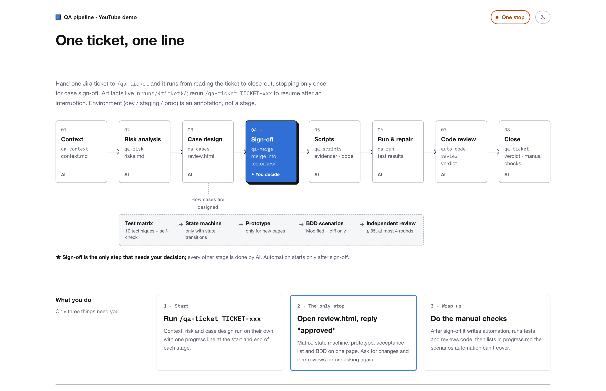

<div align="center">

# Playwright-Web-Agentic-Engineering-Automation

**An end-to-end QA engineering pipeline, driven by AI agents from Jira ticket to release sign-off**

[](https://claude.ai/code)
[](https://openai.com/codex)
[](https://playwright.dev)
[](LICENSE)
[](https://youtube-e2e-smart-report.pages.dev)

**English** · [繁體中文](README.zh-TW.md)

</div>



## Overview

Hand one Jira ticket to `/qa-ticket` and the AI reads the ticket, assesses risk, designs the cases, writes the automation, runs the tests and closes out — **stopping only once, at case sign-off**, for a human decision. Signed-off `.feature` files merge back into the `testcases/` main library; before a release, `/tool-qa-release-gate` makes the go / no-go call for the whole version.

It uses **`https://www.youtube.com`** as the live target. To adopt it, swap the target for your product URL.

> AI handles the tedious work; humans make the quality decisions.

Visual overview: [pipeline.html](pipeline.html)

---

## Pipeline

```
/qa-ticket TICKET-xxx
context → risk → cases → ★sign-off → scripts → run → review → close
 facts     risks   design   merge      automate   verify  code review  verdict
```

| # | Stage | What happens | Artifact (`runs/{ticket}/`) |
|---|---|---|---|
| 1 | context | Read the ticket, walk the target site live, map to the main library | `context.md` |
| 2 | risk | Break the ticket into concrete risks with levels | `risks.md` |
| 3 | cases | Test matrix → state machine → BDD → prototype → independent review | `test_matrix.md`, `cases/`, `review.html` … |
| 4 | ★sign-off | A human reviews `review.html`; signed-off cases merge into `testcases/` | — |
| 5 | scripts | Planner probes the real page for locators → generator writes step / POM | `youtube/evidence/` |
| 6 | run | Run tests, catch fake greens, healer fixes failures | — |
| 7 | review | Code review of the new automation | — |
| 8 | close | Verdict + manual-check list | Close section of `progress.md` |

Rerun `/qa-ticket TICKET-xxx` to resume from the last stage. Environment (dev / staging / prod) is an annotation, not a stage.

- Stage skills and standing tools → [docs/qa-workflow-map.md](docs/qa-workflow-map.md)
- Every stage in detail → [docs/tutorial/04-workflow.md](docs/tutorial/04-workflow.md)
- Every skill's arguments and outputs → [docs/tutorial/03-skills.md](docs/tutorial/03-skills.md)

---

## E2E Automation (youtube/)

An E2E automation framework for YouTube Web, based on **Playwright + playwright-bdd**. Signed-off `.feature` scenarios are implemented here as executable Playwright tests (guest / logged-out, covering search / playback / channel / filters).

→ [youtube/README.md](youtube/README.md)

> ### 📊 Live Test Report
> **→ [youtube-e2e-smart-report.pages.dev](https://youtube-e2e-smart-report.pages.dev)**
>
> Auto-published to Cloudflare Pages after every CI run.

---

## Start Here

→ **[Getting Started (Step 1: Project Overview)](docs/tutorial/01-overview.md)**

Five steps: overview → setup → skills → your first ticket → checklist.

---

## Quick Start

```bash
git clone https://github.com/JulianWangHZ/Playwright-Web-Agentic-Engineering-Automation.git
cd Playwright-Web-Agentic-Engineering-Automation/youtube

# Install dependencies
npm install

# Run tests (use system Chrome when the bundled chromium cannot be downloaded locally)
BROWSER_CHANNEL=chrome npx playwright test --project=ui
```

Open Claude Code at the repo root:

```
/qa-ticket TICKET-123         # test one ticket
/tool-qa-release-gate v1.5    # pre-release sign-off
```

---

## Directory Structure

```
Playwright-Web-Agentic-Engineering-Automation/
├── .claude/
│   ├── skills/            # qa-ticket pipeline and standing tools (index: docs/qa-workflow-map.md)
│   ├── agents/            # automation planner / generator / healer
│   └── rules/             # Gherkin, automation, commit, PR rules
├── docs/
│   ├── tutorial/          # Getting-started guide
│   └── qa-workflow-map.md # Stage → skill single source of truth
├── pipeline.html          # Pipeline overview
├── testcases/             # BDD main library (single source of truth, written only by qa-merge)
├── runs/{ticket}/         # Per-ticket workspace (git-ignored)
├── releases/{version}.md  # Release sign-offs (git-ignored)
└── youtube/               # YouTube Web E2E automation (Playwright + BDD)
```

---

## License

Released under the [MIT License](LICENSE) · Copyright (c) 2026 JulianWangHZ
