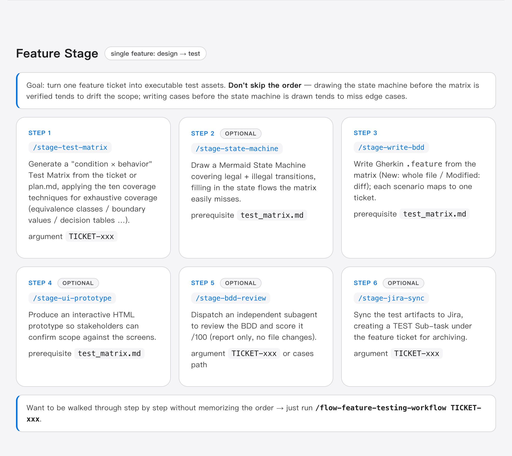
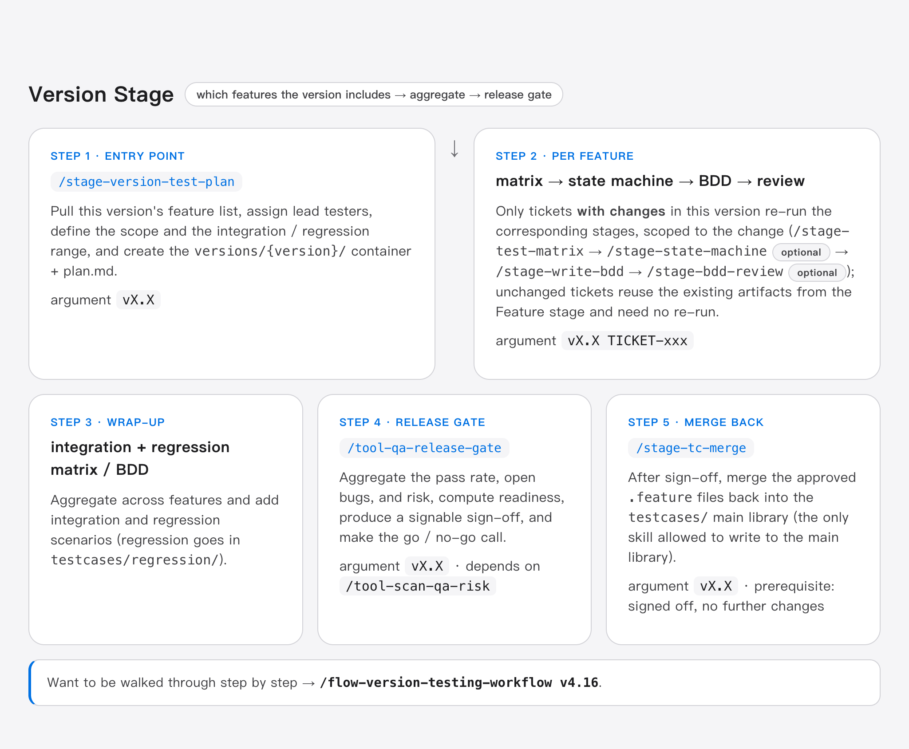
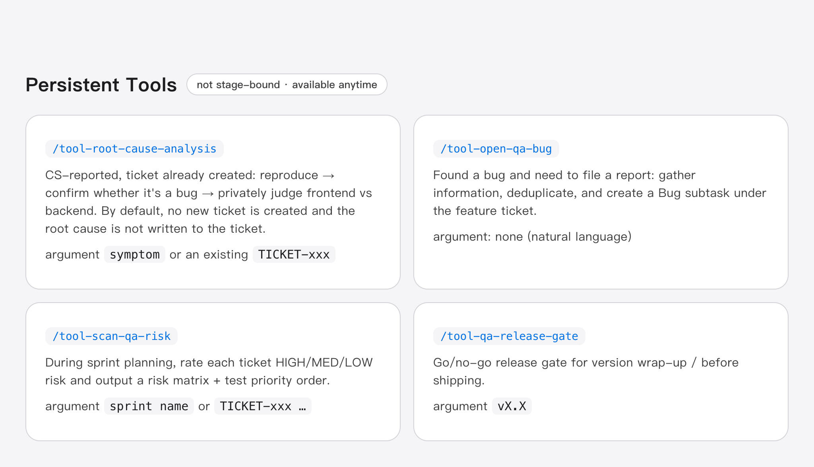
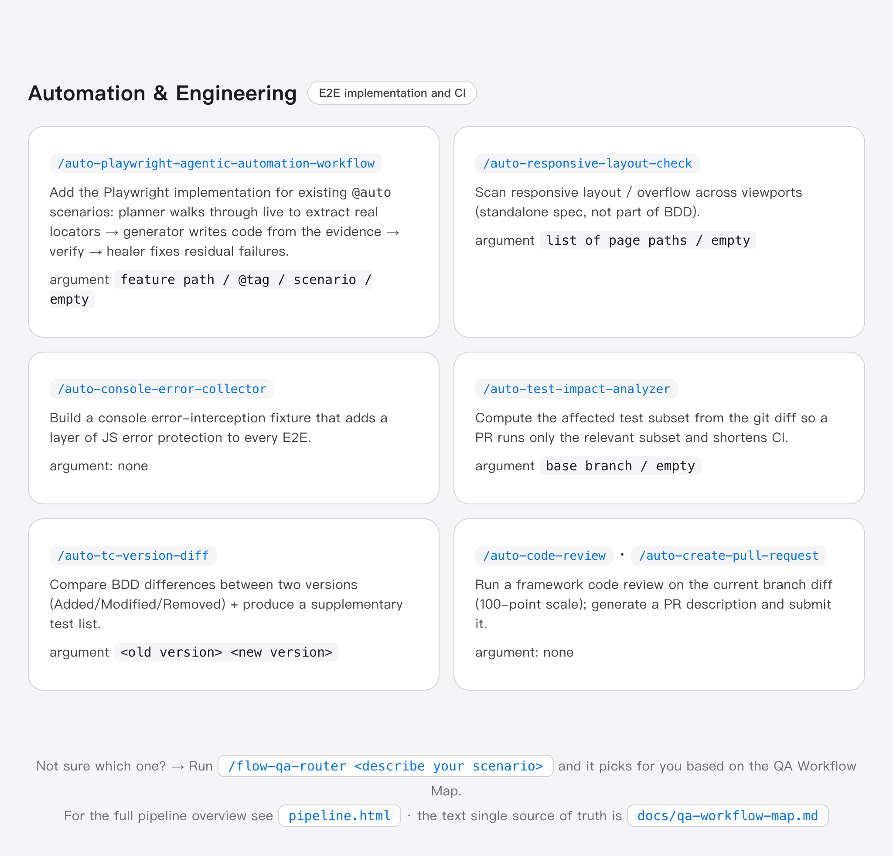

# Full Skill Reference

All skills live in `.claude/skills/{name}/SKILL.md` and are triggered in Claude Code via `/skill-name`.

Skills automatically determine the stage from the argument format: `TICKET-xxx` = Feature, `vX.X TICKET-xxx` = Version, `vX.X` = whole version (Version wrap-up) (see [qa-workflow-map.md](qa-workflow-map.md)).

---

## Workflow Skills

### `/stage-test-matrix`

Test Matrix. Generates a structured condition × behavior matrix from a Jira ticket or plan.md. Dimensions are **exhaustively enumerated per the ten functional test-design techniques in `references/coverage-techniques.md`** (equivalence partitioning / boundary value / decision table / positive-negative-exception / error guessing / state transition / role permission / environment / CRUD / pairwise), and it produces a "coverage-technique self-check table" + "cross-boundary indicators" (non-functional items are marked only with a pointer to the dedicated skill).

| Argument | Stage | Output |
|---|---|---|
| `TICKET-xxx` | Feature | `features/{ticket}/test_matrix.md` |
| `vX.X TICKET-xxx` | Version | `versions/{version}/testcases/{ticket}/test_matrix.md` |
| `vX.X` | Whole version (integration / regression) | `versions/{version}/testcases/regression/test_matrix.md` |

---

### `/stage-state-machine`

State Machine. Run it only when there is clear state transition, eligibility switching, or A-B branching; for simple tickets go straight to `/stage-write-bdd`. It requires that **every legal transition (0-switch) has a corresponding path + lists illegal/unreachable transitions as negatives**, producing a "transition coverage self-check table".

| Argument | Stage | Output |
|---|---|---|
| `TICKET-xxx` | Feature | `features/{ticket}/state_machine.md` |
| `vX.X TICKET-xxx` | Version | `versions/{version}/testcases/{ticket}/state_machine.md` |

---

### `/stage-write-bdd`

BDD `.feature` authoring. Modified → write only this ticket's diff (`# [added]` / `# [changed]`); New → whole file.

| Argument | Stage | Output |
|---|---|---|
| `TICKET-xxx` | Feature | `features/{ticket}/cases/{platform}/*.feature` |
| `vX.X TICKET-xxx` | Version | `versions/{version}/testcases/{ticket}/cases/{platform}/*.feature` |
| `vX.X` | Whole version (regression) | `versions/{version}/testcases/regression/{platform}/*.feature` |

---

### `/stage-ui-prototype`

Interactive HTML prototype. Use it for new modules, complex UI flows, and PM-RD alignment; can be regenerated after a Version requirement change.

| Argument | Stage | Output |
|---|---|---|
| `TICKET-xxx` | Feature | `features/{ticket}/prototype.html` |
| `vX.X TICKET-xxx` | Version | `versions/{version}/testcases/{ticket}/prototype.html` |

---

### `/stage-version-test-plan`

Version test plan. Pulls the Feature list from the Jira version ticket, generates `versions/{version}/plan.md`, and assigns the lead QA.

- **Argument**: `vX.X`
- **Output**: `versions/{version}/plan.md`

---

### `/stage-tc-merge`

Main library merge. **The last step of a Version, the only skill allowed to write to `testcases/`.**

- **Argument**: `vX.X`
- **When**: after all Version BDD reviews are done, `/stage-jira-sync` has run, and it is confirmed to no longer change
- **Flow**:
  1. Read the Version section of `changes.md`, scan delta files, and list the merge-back set
  2. After user confirmation, run the merge (New = copy whole file; Modified = per-Scenario smart merge)
  3. Delete `versions/{version}/testcases/{ticket}/` (keeping `versions/{version}/plan.md` and `changes.md`)
  4. Report back

---

## QA Tool Skills

### `/stage-bdd-review`

After BDD is written, dispatch an **independent subagent** to review the `.feature`, score it, and give suggestions, **producing only a report without changing cases** (human-in-the-loop).

- **Argument**: `<TICKET-xxx | version | cases path>` (Feature/Version is auto-detected from the path)
- **Output**: `{root}/stage-write-bdd_review.md` (score /100 + graded Issues + coverage gap table + suggested Scenarios + Verdict)
- **Scoring dimensions**: source traceability 20 / matrix coverage + technique completeness 25 / Gherkin conventions 20 / business-rule correctness 20 / clarity and executability 10 / Modified appropriateness 5
- **Technique audit**: beyond "scenario ⊇ matrix", it cross-checks `coverage-techniques.md` again to verify "whether the matrix itself missed a technique it should have used" (closing the GIGO feedback loop on the matrix), producing a `🔍 technique coverage self-check` section

---

### `/stage-jira-sync`

Sync test artifacts to Jira, creating a TEST Sub-task under the feature ticket for archiving, shared across Feature / Version.

- **Argument**: `<TICKET-xxx>` (Feature) · `<vX.X stg>` (Version)
- **Output**: 2–3 Jira Sub-tasks (Cases + BDD Review / Test Matrix + Prototype / State Machine)
- **Attachments**: `prototype.html` is uploaded automatically when present
- **Status**: after creation, the assignee is set automatically and the ticket is transitioned to Done

---

### `/tool-open-qa-bug`

Produces a **RIDER-format bug report**, including HTML that can be pasted directly into Jira and a Markdown fallback.

- **Parameters**: none — describe the bug in natural language
- **Format**: current problem → impact scope → attachments → reproduction steps → expected result → test environment → additional information

---

### `/tool-scan-qa-risk`

Sprint risk scan — rates each ticket HIGH/MED/LOW risk and produces a **risk matrix + test priority order**.

- **Parameters**: `<sprint name>` or `<TICKET-xxx TICKET-yyy ...>`
- **Requires**: Jira MCP

---

### `/tool-qa-release-gate`

**Single-point release gate for Version wrap-up / pre-release (go/no-go gate)**. Called manually after the whole Version passes; it aggregates the test pass rate, unclosed bugs, and `/tool-scan-qa-risk` results, computes a readiness score, and produces a sign-off document ready for approval.

- **Parameters**: `<version vX.X>`

---

## Automation & Engineering Skills

### `/auto-playwright-agentic-automation-workflow`

YouTube Web automation implementation orchestration — adds step definitions / Page Objects / fixtures to existing @auto scenarios in the `testcases/` main library. Dispatches `playwright-test-planner` to first walk through in a real browser and extract real locators to produce an "implementation evidence map", then after passing the feasibility gate dispatches `playwright-test-generator` to write code from the evidence map, runs `bddgen` + `playwright test` to verify, and dispatches `playwright-test-healer` for remaining failures. Follows `youtube-automation.md` coding style.

- **Parameters**: `<feature path | @tag | scenario name | empty = scan all gaps>`

---

### `/auto-responsive-layout-check`

YouTube Web responsive layout scan — detects horizontal overflow, text truncation, element overlap, undersized touch targets, and breakpoint-boundary bugs across multiple viewports. Follows `tests/api/` as a standalone spec (non-BDD); the detection tool lands in `src/utils/overflow-detector.ts` and the viewport list in `src/data/viewports.ts`. Adapted from Pramod/responsive-layout-breaker, aligned with `youtube-automation.md`.

- **Parameters**: `<page path list | empty = scan main consumer-facing pages>`

---

### `/auto-console-error-collector`

Console error interception during YouTube Web testing — a fixture collects console errors / uncaught exceptions / unhandled promise rejections, with classification + severity grading + allowlist, giving every E2E an extra layer of JS error protection. The fixture lands in `src/fixtures/console.fixtures.ts` and is merged via mergeTests in `test.fixtures.ts` (§7). Adapted from Pramod/console-error-hunter, aligned with `youtube-automation.md`.

- **Parameters**: none (creates / inspects the console fixture)

---

### `/auto-test-impact-analyzer`

Computes which tests this change affects from the git diff, so a PR runs only the affected subset to shorten CI time.

---

### `/auto-tc-version-diff`

Compares BDD feature file differences between two versions (Added / Modified / Removed scenarios) and produces a changelog and a re-test checklist.

---

### `/auto-code-review`

Runs a Playwright-Web-Agentic-Engineering-Automation framework code review on the current branch's diff, producing a scored report (100-point scale).

---

### `/auto-create-pull-request`

Generates a PR description in `git-pr.md` format from the current branch's commit history and submits it (auto-updates when the PR already exists), including test-layer and document-impact analysis.

---

## Platform Notes

| Platform directory | Product under test | Notes |
|---|---|---|
| `youtube` | `https://www.youtube.com` | Product under test (guest/logged-out) |

> When applying this to your own product, change the target directory to your site and add the corresponding repo mapping in `.claude/CODEBASE.md`.
