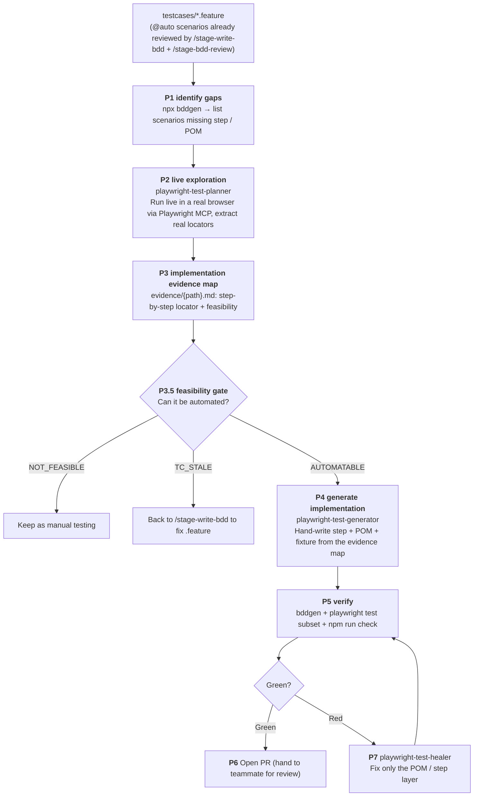

# Agentic Automation Flow

| [← Writing Tests](writing-tests.md) | [Running Tests →](running-tests.md) |
| :---------------------------------- | ----------------------------------: |
| Step 3: how to write each layer     |  Step 4: local, Docker, CI          |

> This is the **recommended way to implement automation**: orchestrate with the `/auto-playwright-agentic-automation-workflow` skill to turn "filling in the implementation for an existing `@auto`
> scenario" into a gated flow. For **how to write and the conventions** of each layer of code, see [writing-tests.md](writing-tests.md);
> this doc only covers the **flow**.

---

## Core philosophy

The `.feature` files have already been reviewed and validated by QA's `/stage-test-matrix → /stage-write-bdd → /stage-bdd-review`—**we do not re-derive scenarios here**. Instead, we take the existing
`@auto` scenarios and **run them live in a real browser**, extract validated real locators, decide whether automation is feasible, and write code accordingly.

This is **live-probe-first**, and also a **hallucination-prevention** measure: it prevents "inventing non-existent selectors / flows", not "inventing non-existent features" (the feature layer is gated by `/stage-bdd-review`). YouTube is an external site with no source code to inspect, so selectors can only be obtained by running live—this principle is especially important here.

---

## Full flow

**Trigger**: `/auto-playwright-agentic-automation-workflow <feature path | @tag | scenario name | empty=scan all gaps>`

---

## The three subagents

| Agent                       | Stage | Responsibility                                                                                                                                          |
| --------------------------- | ----- | ------------------------------------------------------------------------------------------------------------------------------------------------------- |
| `playwright-test-planner`   | P2–P3 | Runs existing `@auto` scenarios live via Playwright MCP, extracts real locators, judges feasibility, produces the "implementation evidence map". **Does not write code** |
| `playwright-test-generator` | P4    | Hand-writes step definition + Page Object + fixture registration from the evidence map. **Every selector must trace back to the evidence map**; does not produce flat specs (specs are generated by bddgen) |
| `playwright-test-healer`    | P7    | On test failure, uses `test_debug` to inspect the real page at the failure point, classifies root cause, fixes the POM / step layer, then re-runs. **Does not delete valid assertions, does not rebuild self-healing** |

---

## Implementation evidence map

The output of `playwright-test-planner`, placed at a path mirroring the feature's relative path:
`testcases/search-filters.feature` → `evidence/search-filters.md`.

- **Purpose**: when the generator writes the POM, every selector must be traceable to a planner-validated locator here (the anti-hallucination basis); it is also the review material for the feasibility gate.
- **Positioning**: a point-in-time exploration record, regenerated on each run; once code lands, `src/` + `tests/` are the living truth.
- For **format and feasibility classification**, see `evidence/README.md` and the `playwright-test-planner` agent definition.

| feasibility    | Meaning                                                              |
| -------------- | ------------------------------------------------------------------- |
| `AUTOMATABLE`  | Every step has a validated locator, ready to hand to the generator |
| `NOT_FEASIBLE` | Depends on login / third party / visual comparison, keep manual    |
| `TC_STALE`     | Live run found product behavior differs from `.feature`, back to `/stage-write-bdd` to fix |

> YouTube tests are all guest state. If a scenario requires login to verify during a live run (e.g. subscribed state), classify it as `NOT_FEASIBLE` and keep it manual.

---

## Two manual gates (divided labor, no rework)

1. **Feasibility gate (P3.5, before code-gen)**: reviews "should we / can we automate this". A single-person fast path can self-review; when tricky or when there is
   `NOT_FEASIBLE` / `TC_STALE`, pull in a senior to look at the evidence map. `TC_STALE` goes back to `/stage-write-bdd`; a suspected product bug goes to `/tool-open-qa-bug`.
2. **PR review (P6, after going green)**: reviews code quality, conventions, and assertion correctness; the PR goes to a teammate.

---

## Start-page seed

The planner / generator's `planner_setup_page` / `generator_setup_page` are provided by `tests/seed.spec.ts` as a start page "located on the YouTube home page" (`page.goto("/")`). YouTube tests are guest state, so the seed does not attach a storageState.

---

## CI Quality Gate

A PR triggers CI: `bddgen + tsc + lint` always run; there is also a `@smoke` happy-path job hitting www.youtube.com. Guest-state tests need no secrets. For execution details see [running-tests.md](running-tests.md).

---

## When not using the skill (manual path)

What the generator actually does above, you can also do by hand—use `bddgen` to identify gaps → fill in step / POM / fixture. For each layer's
**how to write, naming, selector priority, and Wait strategy**, see [writing-tests.md](writing-tests.md). To explore locators manually, use
`playwright-cli` (see "Where do locators come from" in writing-tests.md).

---

| [← Writing Tests](writing-tests.md) | [Running Tests →](running-tests.md) |
| :---------------------------------- | ----------------------------------: |
| Step 3: how to write each layer     |  Step 4: local, Docker, CI          |
