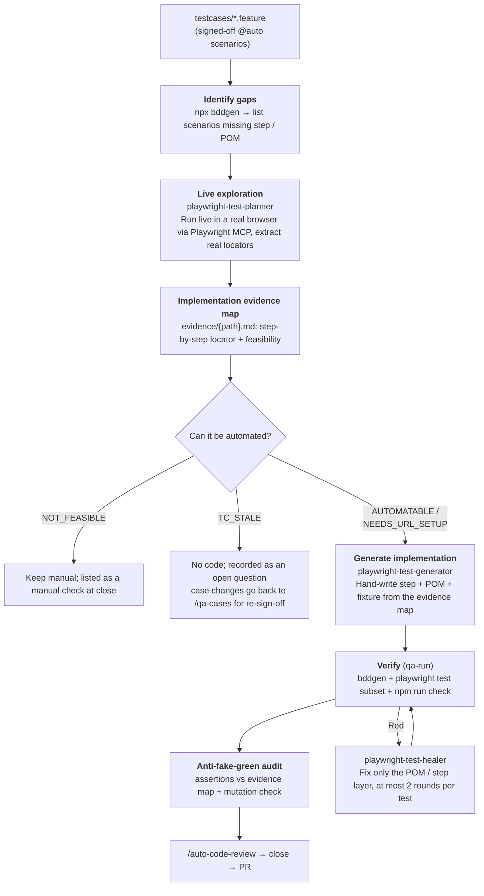

# Agentic Automation Flow

| [← Writing Tests](writing-tests.md) | [Running Tests →](running-tests.md) |
| :---------------------------------- | ----------------------------------: |
| Step 3: how to write each layer     |  Step 4: local, Docker, CI          |

> This is the **recommended way to implement automation**: stages 5–6 of the `/qa-ticket` pipeline (`qa-scripts` → `qa-run`)
> run it automatically; `/qa-scripts` also works on its own. For **how to write and the conventions** of each layer of code, see
> [writing-tests.md](writing-tests.md); this doc only covers the **flow**. The whole pipeline: [pipeline.html](../../pipeline.html).

---

## Core philosophy

The `.feature` files were designed by `qa-cases`, scored by an independent reviewer, and signed off by a human before merging into
`testcases/` — **we do not re-derive scenarios here**. Instead, we take the existing `@auto` scenarios and **run them live in a real
browser**, extract validated real locators, decide whether automation is feasible, and write code accordingly.

This is **live-probe-first**, and also a **hallucination-prevention** measure: it prevents "inventing non-existent selectors / flows", not "inventing non-existent features" (the feature layer is gated by the qa-cases review and human sign-off). YouTube is an external site with no source code to inspect, so selectors can only be obtained by running live—this principle is especially important here.

---

## Full flow

```mermaid
flowchart TD
    F["testcases/*.feature<br/>(signed-off @auto scenarios)"]
    F --> GAP["<b>Identify gaps</b><br/>npx bddgen → list scenarios missing step / POM"]
    GAP --> PL["<b>Live exploration</b><br/>playwright-test-planner<br/>Run live in a real browser via Playwright MCP, extract real locators"]
    PL --> EV["<b>Implementation evidence map</b><br/>evidence/{path}.md: step-by-step locator + feasibility"]
    EV --> J{"Can it be automated?"}
    J -->|NOT_FEASIBLE| MANUAL["Keep manual; listed as a manual check at close"]
    J -->|TC_STALE| STALE["No code; recorded as an open question<br/>case changes go back to /qa-cases for re-sign-off"]
    J -->|"AUTOMATABLE /<br/>NEEDS_URL_SETUP"| GEN["<b>Generate implementation</b><br/>playwright-test-generator<br/>Hand-write step + POM + fixture from the evidence map"]
    GEN --> RUN["<b>Verify</b> (qa-run)<br/>bddgen + playwright test subset + npm run check"]
    RUN --> AUD["<b>Anti-fake-green audit</b><br/>assertions vs evidence map + mutation check"]
    RUN -->|Red| HEAL["playwright-test-healer<br/>Fix only the POM / step layer, at most 2 rounds per test"]
    HEAL --> RUN
    AUD --> CR["/auto-code-review → close → PR"]
```

**Trigger**: `/qa-ticket TICKET-xxx` (the whole pipeline) or `/qa-scripts <TICKET-xxx | feature path | @tag | scenario name | empty=scan all gaps>`

---

## The three subagents

| Agent                       | Dispatched by | Responsibility |
| --------------------------- | ------------- | -------------- |
| `playwright-test-planner`   | `qa-scripts`  | Runs existing `@auto` scenarios live via Playwright MCP, extracts real locators, judges feasibility, produces the "implementation evidence map". **Does not write code** |
| `playwright-test-generator` | `qa-scripts`  | Hand-writes step definition + Page Object + fixture registration from the evidence map. **Every selector must trace back to the evidence map**; does not produce flat specs (specs are generated by bddgen) |
| `playwright-test-healer`    | `qa-run`      | On test failure, inspects the real page at the failure point, classifies root cause, fixes the POM / step layer, then re-runs. **Does not delete valid assertions, does not rebuild self-healing** |

---

## Implementation evidence map

The output of `playwright-test-planner`, placed at a path mirroring the feature's relative path:
`testcases/search-filters.feature` → `evidence/search-filters.md`.

- **Purpose**: when the generator writes the POM, every selector must be traceable to a planner-validated locator here (the anti-hallucination basis); it is also the basis for the feasibility verdict.
- **Positioning**: a point-in-time exploration record, regenerated on each run; once code lands, `src/` + `tests/` are the living truth.
- For **format and feasibility classification**, see `evidence/README.md` and the `playwright-test-planner` agent definition.

| feasibility    | Meaning                                                              |
| -------------- | ------------------------------------------------------------------- |
| `AUTOMATABLE`  | Every step has a validated locator, ready to hand to the generator |
| `NOT_FEASIBLE` | Depends on login / third party / visual comparison, keep manual    |
| `NEEDS_URL_SETUP` | Automatable, but needs a specific start URL / query parameters to reach its precondition |
| `TC_STALE`     | Live run found product behavior differs from `.feature`; no code, the case goes back to `/qa-cases` for re-sign-off |

> YouTube tests are all guest state. If a scenario requires login to verify during a live run (e.g. subscribed state), classify it as `NOT_FEASIBLE` and keep it manual.

---

## Human gates

1. **Case sign-off (stage 4 of `/qa-ticket`, before any code)**: a human signs off the `.feature` files before automation starts; cases are not re-questioned here.
2. **PR review (after going green)**: `/auto-code-review` reviews first, then a teammate reviews code quality, conventions, and assertion correctness.

Feasibility verdicts don't stop the run: `NOT_FEASIBLE` / `TC_STALE` are recorded in `runs/{ticket}/progress.md` and listed at close. When `/qa-scripts` is used directly on a large scope, it confirms once before writing code.

---

## Start-page seed

The planner / generator's `planner_setup_page` / `generator_setup_page` are provided by `tests/seed.spec.ts` as a start page "located on the YouTube home page" (`page.goto("/")`). YouTube tests are guest state, so the seed does not attach a storageState.

---

## CI Quality Gate

A PR triggers CI: `bddgen + tsc + lint` always run; there is also a `@smoke` happy-path job hitting www.youtube.com. Guest-state tests need no secrets. For execution details see [running-tests.md](running-tests.md).

---

## When not using the skill (manual path)

What the generator actually does above, you can also do by hand—use `bddgen` to identify gaps → fill in step / POM / fixture. For each layer's
**how to write, naming, selector priority, and Wait strategy**, see [writing-tests.md](writing-tests.md). To explore locators manually, use
`playwright-cli` (see "Where do locators come from" in writing-tests.md).

---

| [← Writing Tests](writing-tests.md) | [Running Tests →](running-tests.md) |
| :---------------------------------- | ----------------------------------: |
| Step 3: how to write each layer     |  Step 4: local, Docker, CI          |
